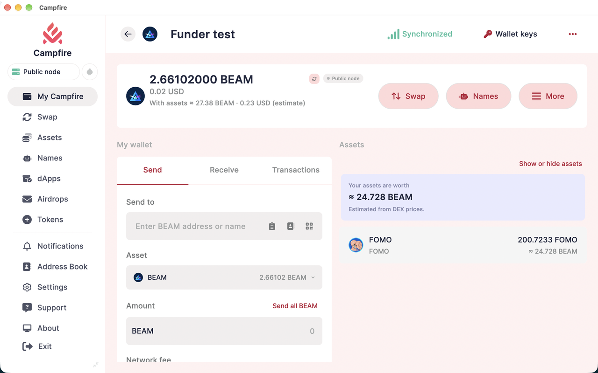
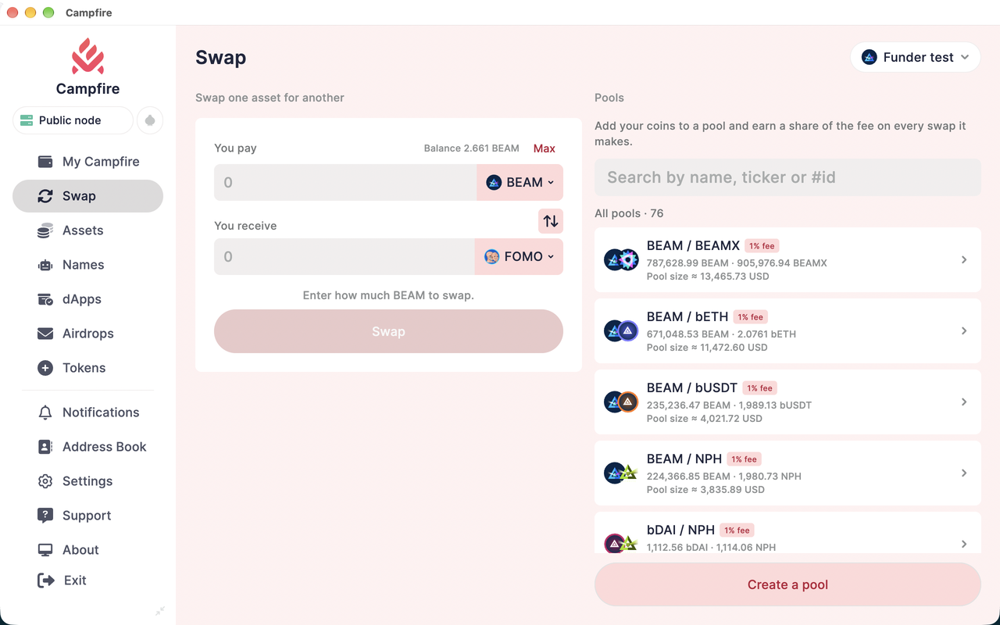
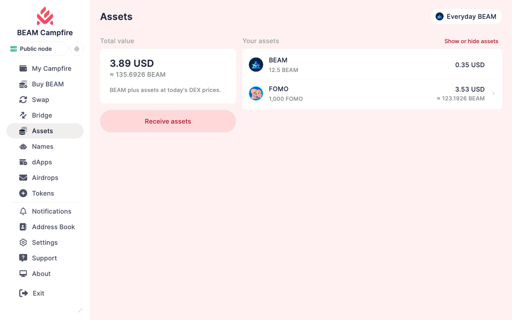
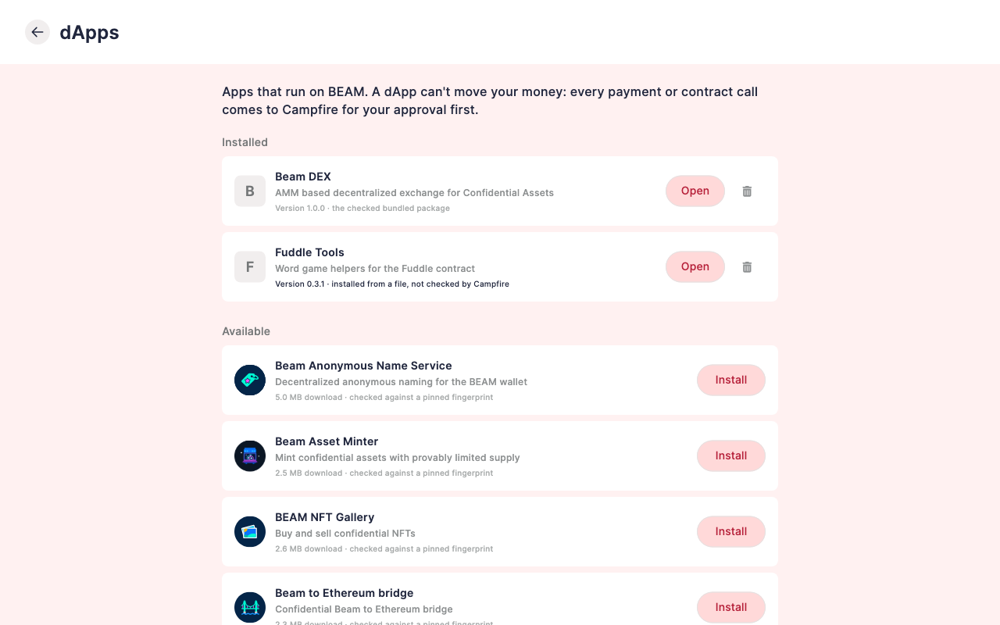
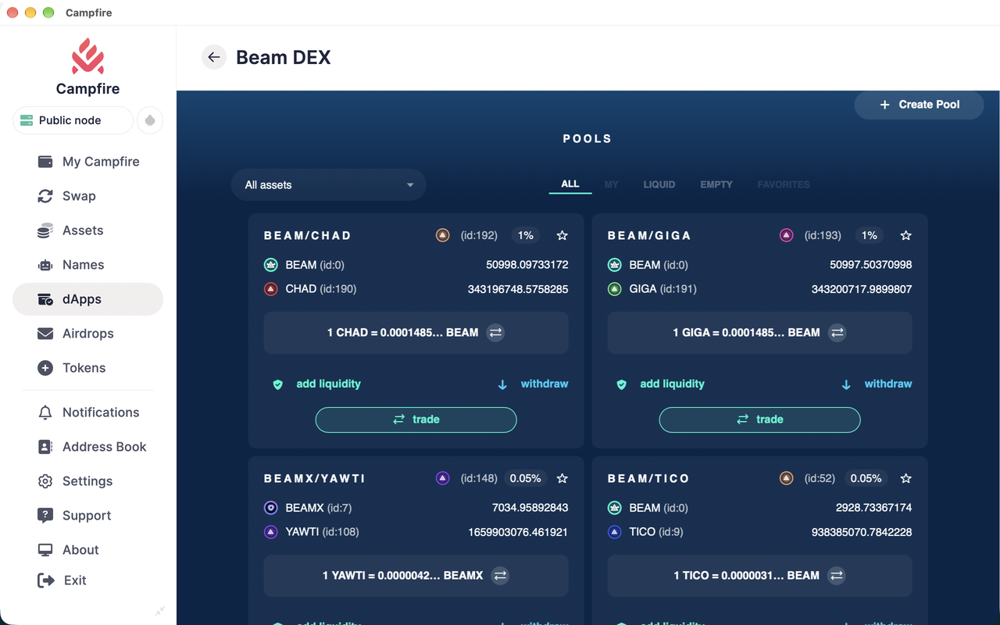
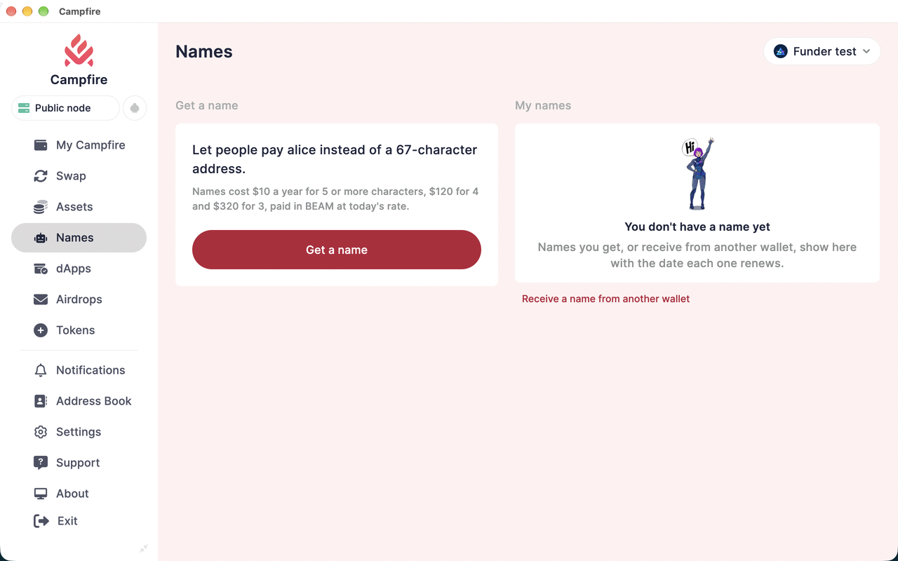
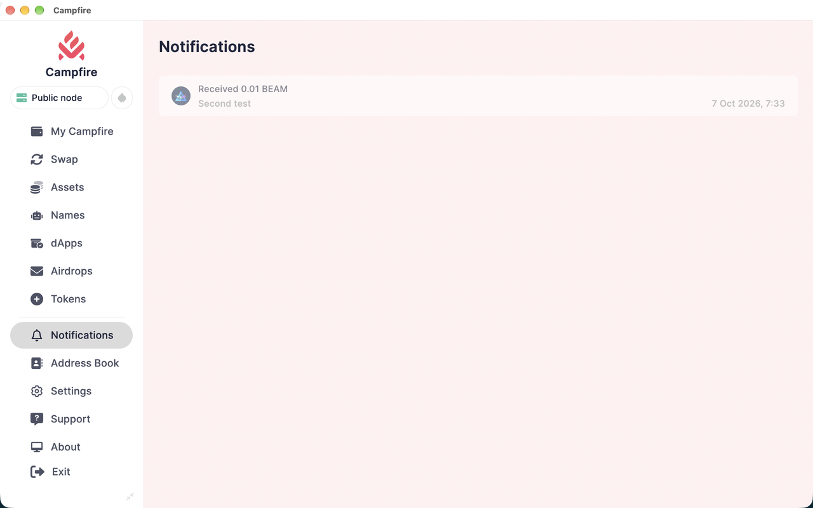
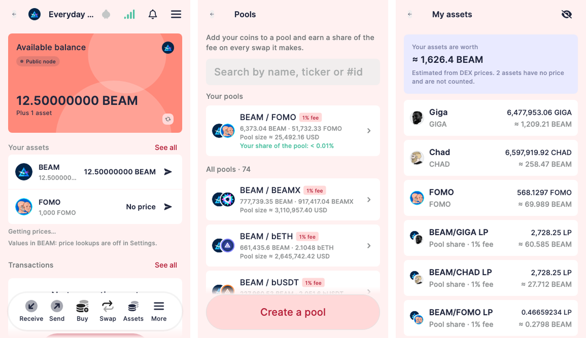

# BEAM Campfire

BEAM Campfire is [Campfire](https://github.com/firoorg/campfire) (a white-label build of
[Stack Wallet](https://github.com/cypherstack/stack_wallet)) converted from Firo to
[BEAM Privacy](https://beam.mw): Campfire's design, philosophy and security, with everything BEAM's
wallets can do. BEAM's own HF6-capable core (7.5.14493) runs **inside the app**, as BEAM's desktop
wallet runs it: the wallet and your private node are part of BEAM Campfire, not separate programs, and keys
never leave the device.

**Status: public beta.** Tested on BEAM mainnet with small amounts. Use it with funds you can afford to
lose while it is in beta.



## Download

Get the latest build from [Releases](https://github.com/vsnation/campfire-beam/releases): macOS (Apple
Silicon) `.dmg`, Android `.apk` (arm64 phones; x86_64 for emulators and some Chromebooks), Linux (x86_64) `.tar.gz` and Windows (x64) `.zip`. Every file
is listed in `SHA256SUMS.txt`; check it before you install:

```bash
shasum -a 256 -c SHA256SUMS.txt --ignore-missing      # macOS / Linux
certutil -hashfile BEAM-Campfire-<version>-windows-x86_64.zip SHA256   # Windows
```

- **macOS:** open the DMG and drag BEAM Campfire to Applications. The app is not notarized yet, so the
  first launch needs right-click → Open.
- **Android:** open the APK and allow installing from this source. The signing certificate's SHA-256 is
  `A6:D8:81:7E:AB:D6:A5:19:F4:77:88:70:54:0A:0D:96:72:A1:BA:46:6B:44:7E:7E:06:C5:11:B0:AD:C0:E9:9F`.
- **Linux:** unpack the archive and run `campfirebeam` in its folder. Needs glibc 2.38 or later (Ubuntu
  24.04, Fedora 39, Debian 13, Mint 22 or newer) and a GTK 3 desktop.
- **Windows:** unzip and run `campfirebeam.exe`. It is not code-signed yet, so SmartScreen may ask:
  More info → Run anyway.
- It installs beside the original Campfire as its own app, "BEAM Campfire" (app id
  `com.vsnation.campfirebeam`), and never touches Campfire or its data.

## Screenshots

| | |
|---|---|
|  |  |
| **Swap** on BEAM's DEX: every pool, named assets, sizes in your currency | **Assets**: every Confidential Asset you hold, valued at today's DEX prices |
|  |  |
| **dApps**: BEAM's dApp store; a dApp cannot move money without your approval | BEAM's own dApps run inside Campfire, as in the BEAM wallet |
|  |  |
| **Names**: pay `alice` instead of a 67-character address | **Notifications** for payments you receive |



## What works today

- Create and restore BEAM wallets (12-word phrase, checksum-checked), Campfire's password, backups and themes.
- Several wallets side by side, each with its own BEAM core; switching is instant.
- **Import a wallet from its `wallet.db` file** and its password (My Campfire › All wallets › Import
  wallet.db) when you have the file but no recovery phrase. Your file is copied, never changed.
- **Tor, if you switch it on:** every connection (BEAM nodes, your private node's peers, prices, the
  explorer, images) goes through Tor or is not made at all; node names are looked up inside Tor too.
- Opens instantly from cache; sync status is honest (never "synced" when behind or on a dead fork).
- Send to an address or a **BEAM name** (BANS); receive with regular, offline, max-privacy and public addresses.
- Transaction history in plain language, cancel, payment proofs, notifications for payments received.
- **Confidential Assets** as token wallets, with copycat detection, names from the chain and values in your
  currency (BEAM's price, assets priced through their DEX pools).
- **DEX**: swap, pools, add/withdraw liquidity, create a pool — every confirmation shows what the signed
  transaction actually does. A swap interrupted by quitting the app can never run twice.
- **BEAM names**: register, renew, transfer, sell, buy; money sent to your names is shown on the home screen
  with one-tap Claim.
- **dApps**: store, browser and one approval sheet for every request.
- **Airdrop vouchers**, **token minter** and **burn**.
- **Private node** (desktop), built into the app: the wallet starts on a public node at once, syncs your own
  node in the background (fast sync, as BEAM's desktop wallet: about an hour; about 12 GB while it sets up, then
  about 8 GB; it starts only with 14 GB free) and switches to it only once the node is ready and serving the
  wallet. Every public BEAM node (`eu-nodes`, `us-nodes`, `eu-node01`–`04`,
  `us-node01`–`04`) is listed in Settings › Nodes.

Proven live on BEAM mainnet with small amounts: send/receive between wallets, DEX swap, airdrop create and
claim, dApps.

## Roadmap

**Release 1 — macOS (DMG), Android (APK), Linux, Windows**
- [x] BEAM wallet core, honest sync, private node with seamless handover
- [x] Send/receive (all address types), BEAM names, assets, DEX, dApps, airdrops, minter, history
- [x] Security hardening from the internal review (dApp approvals, asset look-alikes, price sanity)
- [x] Every feature one or two taps from the wallet (side menu on desktop, bottom bar on phones)
- [x] Dashboard: every valuable asset with its fiat value, cached prices
- [x] macOS DMG and Android APK
- [x] Linux and Windows builds (their BEAM core is built and verified in CI)
- [ ] iOS on the App Store (runs on the iOS Simulator today)
- [x] The BEAM core and the private node inside the app (no wallet-api or beam-node programs)
- [x] Tor for every connection when switched on; import from wallet.db
- [ ] iOS web app (PWA) — built and tested in the iOS Simulator; needs its own domain to go online

**Release 2**
- [ ] Ethereum: ETH and ERC-20 tokens, with **WBEAM** as a default token
- [ ] BEAM ↔ Ethereum bridge (deposit addresses)
- [ ] Games (Fuddle, MemeClash) and atomic swaps

## Building

```bash
cd scripts && ./build_app.sh -a campfire -p <linux|macos|android> -v <version> -b <build>
```

Flutter 3.47.2. The BEAM core is built from tag `beam-7.5.14493` as one library inside the app
(`scripts/beam/core/lib/`, with Campfire's patches) and pinned by SHA-256 per platform; the app checks it
before loading it.

---

[](https://codecov.io/gh/cypherstack/stack_wallet)

# Stack Wallet
Stack Wallet is a fully open source cryptocurrency wallet. With an easy to use user interface and quick and speedy transactions, this wallet is ideal for anyone no matter how much they know about the cryptocurrency space. The app is actively maintained to provide new user friendly features.

<a href="https://play.google.com/store/apps/details?id=com.cypherstack.stackwallet">
</img>
</a>

## Feature List

Highlights include:
- 23 Different cryptocurrencies:
    - [Bitcoin](https://bitcoin.org/en/)
    - Bitcoin Frost
    - [Bitcoin Cash](https://bch.info/en/)
    - [Banano](https://banano.cc/)
    - [Cardano](https://cardano.org/)
    - [Dash](https://www.dash.org/)
    - [Dogecoin](https://dogecoin.com/)
    - [Epic Cash](https://linktr.ee/epiccash)
    - [MimbleWimbleCoin](https://mwc.mw)
    - [Ethereum](https://ethereum.org/en/)
    - [Ecash](https://e.cash/)
    - [Fact0rn](https://www.fact0rn.io/)
    - [Firo](https://firo.org/)
    - [Litecoin](https://litecoin.org/)
    - [Monero](https://www.getmonero.org/)
    - [Nano](https://nano.org/)
    - [Namecoin](https://www.namecoin.org/)
    - [Particl](https://particl.io/)
    - [Peercoin](https://www.peercoin.net/)
    - [Salvium](https://salvium.io/)
    - [Solana](https://solana.com/)
    - [Stellar](https://stellar.org/)
    - [Tezos](https://tezos.com/)
    - [Wownero](https://wownero.org/)
    - [Xelis](https://xelis.org/)
- All private keys and seeds stay on device and are never shared.
- Easy backup and restore feature to save all the information that's important to you.
- Trading cryptocurrencies through our partners.
- Custom address book
- Favorite wallets with fast syncing
- Custom Nodes.
- Open source software.
- No ads.

## Building

You can look at the [build instructions](docs/building.md) for more details.
